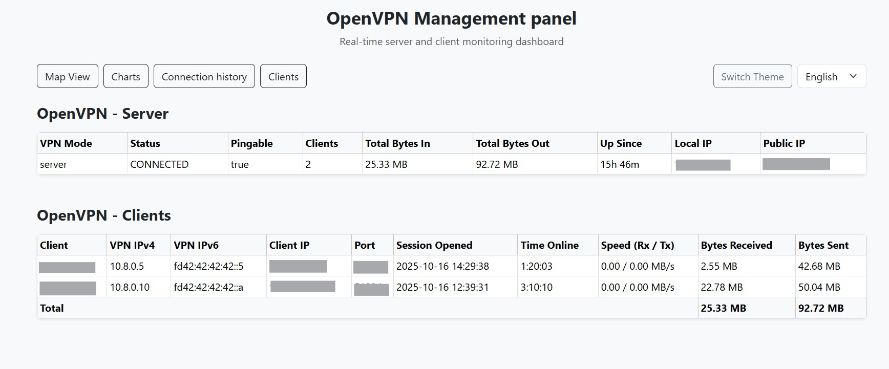
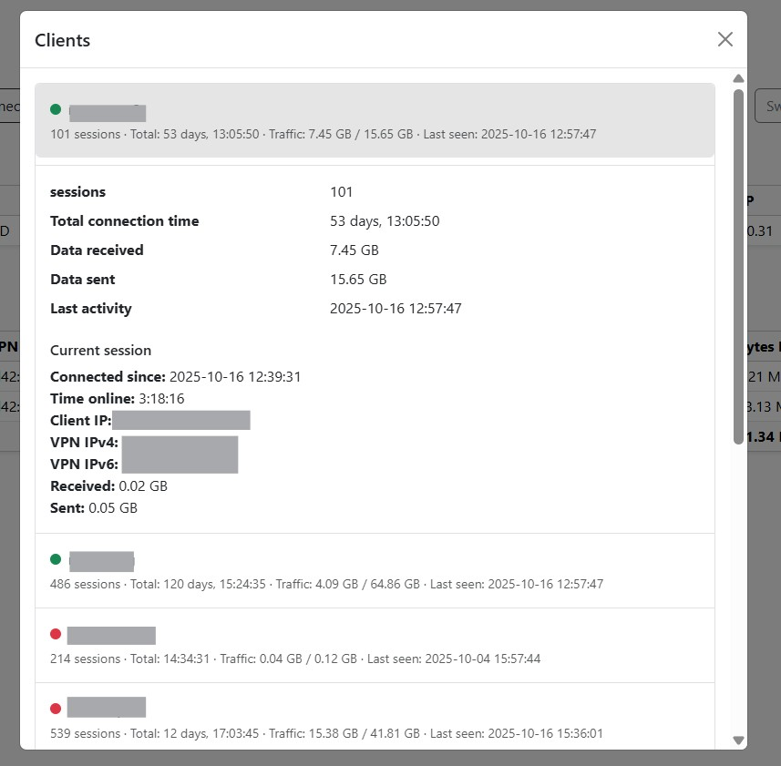
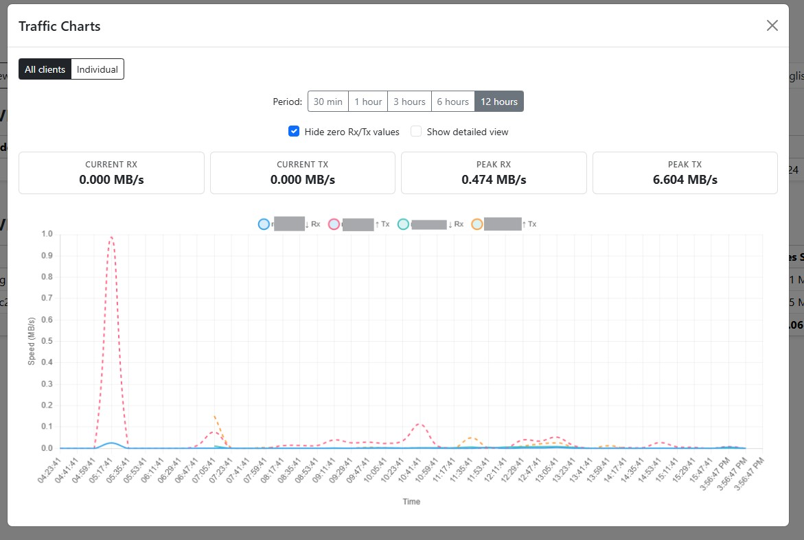
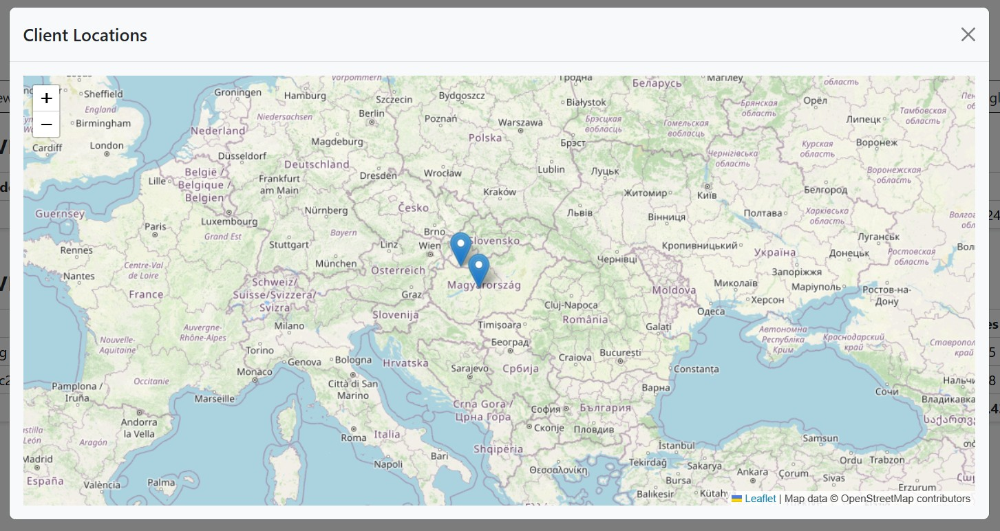
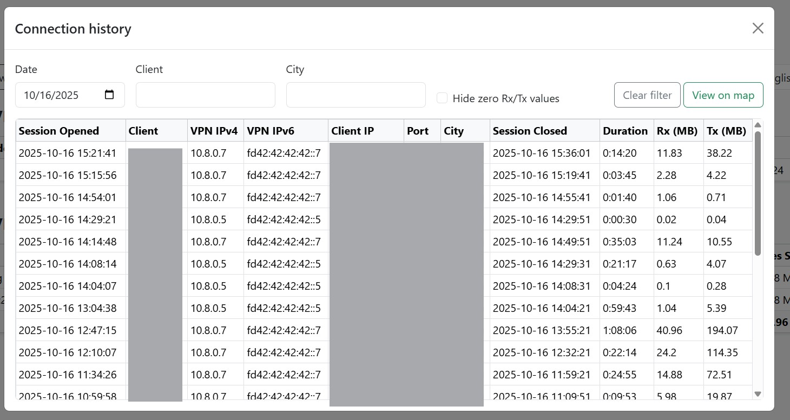

# OpenVPN Monitor

If you find this project useful, consider supporting continued development:

[](https://buymeacoffee.com/scuruci)
[](https://revolut.me/s_curuci)

---

Inspired by [furlongm/openvpn-monitor](https://github.com/furlongm/openvpn-monitor) written from scratch a modern web dashboard for real-time monitoring of OpenVPN server activity. Track active connections, analyze traffic patterns, view session history with geolocation, and visualize traffic metrics — all through an intuitive web interface.



---

## Screenshots

<table>
  <tr>
    <td width="50%">
      
      <p align="center"><b>Real-time Client Monitoring</b></p>
    </td>
    <td width="50%">
      
      <p align="center"><b>Traffic Analytics & Charts</b></p>
    </td>
  </tr>
  <tr>
    <td width="50%">
      
      <p align="center"><b>Interactive Geolocation Map</b></p>
    </td>
    <td width="50%">
      
      <p align="center"><b>Complete Session History</b></p>
    </td>
  </tr>
</table>

---

## Features

### Core Monitoring
- **Real-time Client Dashboard** - Live view of connected VPN clients with connection details
- **Traffic Analytics** - Real-time traffic charts with 24-hour historical data and multiple time periods (30m, 1h, 3h, 6h, 12h)
- **Session History** - Complete history of all VPN sessions with automatic archival (keeps last 90 days, archives older data monthly)
- **Server Status** - Server health monitoring with uptime, connection status, and public IP detection

### Geolocation & Mapping
- **Automatic Geolocation** - IP geolocation for all connected clients via ip-api.com
- **Interactive Maps** - Leaflet-based maps showing client locations in real-time
- **Historical Location Data** - Preserved geolocation in session archives

### Data Management
- **Smart History Archival** - Automatic rotation of old sessions to compressed monthly archives (`.json.gz`)
- **24-Hour Traffic Retention** - Traffic metrics collected every 10 seconds with automatic cleanup
- **Persistent Storage** - All data stored in JSON files with atomic updates and file locking

### User Experience
- **Multi-language Support** - English and Russian interface with easy language switching
- **Multiple Display Modes** - Aggregated and per-client traffic views with dynamic scaling
- **Responsive Design** - Bootstrap-based UI optimized for desktop and mobile
- **RESTful API** - Full API access for integration with external systems

### Technical Features
- **Docker Ready** - Single-command deployment with Docker Compose
- **Non-root Container** - Runs as unprivileged user (UID 1000) for security
- **API Caching** - Two-level caching strategy (request-level + response-level) for optimal performance
- **Timezone Support** - Configurable timezone for accurate session duration calculations
- **Traefik Integration** - Built-in labels for reverse proxy and HTTPS setup

---

## Quick Start

Get OpenVPN Monitor running in under 5 minutes.

> **Note:** All commands use `docker compose` (Compose v2 syntax). For Compose v1, replace `docker compose` with `docker-compose` throughout this guide.

```bash
# 1. Add current user to docker group (if not already done)
sudo usermod -aG docker $USER
newgrp docker  # Apply changes without logout

# 2. Create directory and set permissions
sudo mkdir -p /var/www/openvpn-monitor
sudo chown -R $USER:$USER /var/www/openvpn-monitor

# 3. Clone repository directly into the directory
git clone https://github.com/farggus/openvpn-monitor.git /var/www/openvpn-monitor
cd /var/www/openvpn-monitor

# 4. Set permissions for container user
sudo mkdir -p data
sudo chown -R 1000:1000 .

# 5. Configure environment
cp .env.example .env
nano .env  # IMPORTANT: Set timezone (OPENVPN_MONITOR_TZ) and change default password

# 6. Start container (choose one):

# Option A: With Traefik (default)
docker compose up --build -d

# Option B: Standalone on port 5000
docker compose -f docker-compose.standalone.yml up --build -d

# 7. Check logs
docker compose logs -f
```

Access dashboard at:
- **With Traefik:** `https://your-domain.com`
- **Standalone:** `http://your-server-ip:5000`

---

## Prerequisites

Before installing, ensure you have:

### Required
- **OpenVPN Server** - Running instance with status logging enabled
- **Docker & Docker Compose** - Docker 20+ with Compose v1.29+ or v2
- **Docker Permissions** - Current user must be in `docker` group (see [Pre-installation Steps](#pre-installation-steps))
- **Status Log Permissions** - Readable by UID 1000 (see [Pre-installation Steps](#pre-installation-steps))

### Optional (depends on deployment mode)
- **Traefik v2** - For reverse proxy and HTTPS (required for `docker-compose.yml`, not needed for `docker-compose.standalone.yml`)
- **Internet Access** - For geolocation (ip-api.com) and public IP detection
- **Domain Name** - For production deployment with HTTPS via Traefik

### Minimum System Requirements
- **RAM:** 256 MB
- **Disk:** 500 MB (including Docker image)
- **CPU:** 1 core

---

## Installation

### Pre-installation Steps

#### 1. Configure Docker Permissions

Add your user to the `docker` group to run Docker commands without sudo:

```bash
# Add current user to docker group
sudo usermod -aG docker $USER

# Apply group changes (choose one):
# Option A: Log out and log back in
exit  # then reconnect via SSH

# Option B: Apply changes without logout
newgrp docker

# Verify docker access (should work without sudo)
docker ps
```

**Note:** If you get "Permission denied" errors when running Docker commands, this step is required.

#### 2. Configure OpenVPN Status Logging

Edit your OpenVPN server configuration (`/etc/openvpn/server.conf`):

```conf
...
status /var/log/openvpn/status.log
```

Restart OpenVPN server:
```bash
sudo systemctl restart openvpn@server
```

#### 3. Set Status Log Permissions

The container runs as non-root user (UID 1000) and needs read access to `status.log`:

```bash
sudo chmod 644 /var/log/openvpn/status.log
```

**Security Note:** The status log contains only monitoring data (IP addresses, traffic stats, connection times) — no credentials or sensitive keys.

#### 4. Create Traefik Network (Optional)

If using Traefik for reverse proxy:

```bash
docker network create proxy
```

---

### Docker Compose Installation (Recommended)

#### Step 1: Clone Repository

Choose your installation directory:

```bash
# Default location: /var/www
cd /var/www
git clone https://github.com/farggus/openvpn-monitor.git
cd openvpn-monitor

# Alternative location (adjust paths accordingly)
# cd /home/app_data && git clone ...
```

#### Step 2: Set Directory Permissions

Container runs as UID 1000 for security:

```bash
sudo mkdir -p data
sudo chown -R 1000:1000 /var/www/openvpn-monitor
```

For custom paths:
```bash
sudo chown -R 1000:1000 /path/to/your/openvpn-monitor
```

#### Step 3: Configure Environment Variables

Create `.env` file from template:

```bash
cp .env.example .env
```

**Edit `.env` file** (required configuration):

```bash
# Required: Your domain name (for Traefik mode)
OPENVPN_DOMAIN=vpn-monitor.example.com

# Required: Change default Basic Auth password (for Traefik mode)
# Generate with: htpasswd -nbB openvpn YourSecurePassword
# Remember to escape $ as $$ in .env file
OPENVPN_BASIC_AUTH=openvpn:$$2y$$05$$your_hashed_password_here

# IMPORTANT: Set your timezone to display correct session times
# Use your server's timezone or the timezone where you want times displayed
OPENVPN_MONITOR_TZ=Europe/Bucharest
```

**⚠️ Important Notes:**
- The `.env.example` contains a default password (`openvpn123`) for testing. **You MUST change this before production deployment.**
- **Timezone is critical**: If not set correctly, session times will be wrong (e.g., +3 hours offset). Check your server's timezone with `timedatectl` and use the corresponding IANA timezone name.

<details>
<summary><b>Optional Environment Variables (click to expand)</b></summary>

Most settings have sensible defaults. Override only if needed:

```bash
# Timezone (default: Europe/Bucharest)
OPENVPN_MONITOR_TZ=America/New_York

# Server local IP (auto-detected if not set)
OPENVPN_LOCAL_IP=10.8.0.1

# Server geolocation (disabled by default for security)
OPENVPN_SERVER_GEOLOCATION=false

# File paths (usually don't need to change)
OPENVPN_STATUS_LOG=/var/log/openvpn/status.log
OPENVPN_HISTORY_LOG=/app/data/session_history.json
OPENVPN_ACTIVE_SESSIONS=/app/data/active_sessions.json
OPENVPN_SERVER_STATUS=/app/data/server_status.json
OPENVPN_TRAFFIC_METRICS=/app/data/traffic_metrics.json
```

See [Configuration Reference](#configuration-reference) for full details.
</details>

#### Step 4: Verify Docker Compose Configuration

Check `docker-compose.yml` volume mounts:

```yaml
volumes:
  - /var/log/openvpn:/var/log/openvpn:rw  # OpenVPN status.log location
  - ./data:/app/data:rw                    # Data directory
```

**Adjust `/var/log/openvpn` path** if your OpenVPN logs are in a different location.

#### Step 5: Choose Deployment Mode

##### Option A: With Traefik (Recommended for Production)

Use default `docker-compose.yml` with Traefik integration. Ensure:
- Traefik is running
- Network `proxy` exists (`docker network create proxy`)
- DNS points to your server
- Domain configured in `.env` file

Start container:
```bash
docker compose up --build -d
```

Access at: `https://vpn-monitor.example.com`

##### Option B: Standalone (Direct Port Access)

Use `docker-compose.standalone.yml` for simple deployment without Traefik:

```bash
docker compose -f docker-compose.standalone.yml up --build -d
```

Access at: `http://your-server-ip:5000`

**⚠️ Important Security Notes:**
- This mode does **NOT** include HTTPS or Basic Authentication
- The web interface is publicly accessible without password protection
- **For production:** Use Option A (with Traefik) or add nginx/Apache reverse proxy with authentication
- See [docs/NGINX_SETUP.md](docs/NGINX_SETUP.md) for adding authentication

#### Step 6: Verify Installation

Check container status:
```bash
docker compose logs -f
```

Look for:
- ✅ `OpenVPN background logger started...`
- ✅ `Traffic collector initialized...`
- ✅ No permission errors on `status.log`

Check data files:
```bash
ls -lh data/
```

Should contain:
- `active_sessions.json`
- `session_history.json`
- `server_status.json`
- `traffic_metrics.json`

#### Step 7: First Login

**For Traefik deployment (Option A):**
1. Open dashboard URL
2. Enter Basic Auth credentials (username: `openvpn`, password from `.env`)
3. Wait 10-20 seconds for initial data collection
4. Client table should populate with active VPN connections

**For Standalone deployment (Option B):**
1. Open `http://your-server-ip:5000` (no authentication required by default)
2. Wait 10-20 seconds for initial data collection
3. Client table should populate with active VPN connections
4. **Important:** Consider adding nginx/Apache reverse proxy with authentication (see [docs/NGINX_SETUP.md](docs/NGINX_SETUP.md))

---

### Manual Installation (Development)

For local development without Docker, see [docs/DEVELOPMENT.md](docs/DEVELOPMENT.md) for detailed setup instructions including:

- Python virtual environment setup
- Running Flask and background logger
- Working with tests and code formatting
- Debugging tips and common development tasks

---

## Configuration Reference

### Environment Variables

All variables are optional with sensible defaults:

| Variable | Description | Default | Example |
|----------|-------------|---------|---------|
| **`OPENVPN_DOMAIN`** | Domain name for Traefik routing | `localhost` | `vpn.example.com` |
| **`OPENVPN_BASIC_AUTH`** | Traefik Basic Auth credentials | `openvpn:openvpn123` | `user:$$2y$$05$$...` |
| **`OPENVPN_MONITOR_TZ`** | Timezone for session calculations | `Europe/Bucharest` | `America/New_York` |
| `OPENVPN_STATUS_LOG` | OpenVPN status file path | `/var/log/openvpn/status.log` | Custom path |
| `OPENVPN_HISTORY_LOG` | Session history JSON file | `/app/data/session_history.json` | Custom path |
| `OPENVPN_ACTIVE_SESSIONS` | Active sessions JSON file | `/app/data/active_sessions.json` | Custom path |
| `OPENVPN_SERVER_STATUS` | Server status JSON file | `/app/data/server_status.json` | Custom path |
| `OPENVPN_TRAFFIC_METRICS` | Traffic metrics JSON file | `/app/data/traffic_metrics.json` | Custom path |
| `OPENVPN_SERVER_GEOLOCATION` | Enable server location tracking | `false` | `true` (not recommended) |
| `OPENVPN_LOCAL_IP` | Server local IP address | Auto-detected | `10.8.0.1` |

### Setting Basic Authentication

Generate secure password hash:

```bash
htpasswd -nbB openvpn YourSecurePassword
```

Output example: `openvpn:$2y$05$abc123...`

**Add to `.env` file** (escape `$` as `$$`):
```bash
OPENVPN_BASIC_AUTH=openvpn:$$2y$$05$$abc123...
```

For multiple users:
```bash
OPENVPN_BASIC_AUTH=user1:$$2y$$05$$...,user2:$$2y$$05$$...
```

### Timezone Configuration

Use IANA timezone names:

```bash
# Valid examples
OPENVPN_MONITOR_TZ=Europe/Bucharest
OPENVPN_MONITOR_TZ=America/New_York
OPENVPN_MONITOR_TZ=Asia/Tokyo

# Invalid (will cause errors)
OPENVPN_MONITOR_TZ=EET  # Use Europe/Bucharest instead
OPENVPN_MONITOR_TZ=UTC-5  # Use America/New_York instead
```

[Full list of IANA timezones](https://en.wikipedia.org/wiki/List_of_tz_database_time_zones)

---

## API Reference

### Endpoints

| Method | URL | Description | Cache TTL |
|--------|-----|-------------|-----------|
| GET | `/api/clients` | Active clients with traffic and geolocation | 10s |
| GET | `/api/history` | Completed sessions (last 90 days) | None |
| GET | `/api/history/archive-stats` | Archive statistics (monthly summaries) | None |
| GET | `/api/server-status` | Server status and total traffic | 10s |
| GET | `/api/clients/summary` | Per-client aggregated statistics | 10s |
| GET | `/api/traffic-metrics` | Historical traffic data with period filter | 10s |
| GET | `/api/translations` | UI translations for current locale | None |

### Examples

```bash
# Get active clients
curl http://localhost:5000/api/clients

# Get session history (last 90 days)
curl http://localhost:5000/api/history

# Get server status
curl http://localhost:5000/api/server-status

# Get traffic metrics for last hour
curl http://localhost:5000/api/traffic-metrics?period=60

# Get archive statistics
curl http://localhost:5000/api/history/archive-stats
```

**Period values for traffic metrics:** 30 (30m), 60 (1h), 180 (3h), 360 (6h), 720 (12h)

### API Caching Strategy

Two-level caching for optimal performance:

#### 1. Request-Level Caching (Flask `g` object)
- Single parse per HTTP request
- Shared across multiple endpoint calls within same request
- Fresh data on each HTTP request (cleared after response)
- Function: `_get_cached_clients()` in `app/routes.py`

#### 2. Response-Level Caching (Flask-Caching)
- In-memory SimpleCache with 10-second TTL
- Matches data update frequency (logger runs every 10 seconds)
- Cached endpoints: `/api/clients`, `/api/server-status`, `/api/clients/summary`, `/api/traffic-metrics`
- Benefits: Reduced disk I/O, lower CPU usage, faster response times

**Result:** Sub-100ms API response times even under heavy load.

---

## Architecture

### System Overview

**Components:**
- **Flask Web Application** - API endpoints and web UI (port 5000)
- **Background Logger** - Parses status.log, collects metrics (10s interval)
- **Data Storage** - JSON files with atomic updates and file locking
- **Optional Traefik** - Reverse proxy with HTTPS and Basic Auth

**Data Flow:**
```
OpenVPN Server → status.log → Background Logger → JSON Files → Flask API → Web Browser
```

**Key Features:**
- Non-root container (UID 1000)
- Two-level API caching (request + response)
- Automatic session archival (90 days retention)
- IPv4/IPv6 support with geolocation

For detailed architecture documentation, see [docs/DEVELOPMENT.md](docs/DEVELOPMENT.md).

---

## Development

For development setup, testing, code formatting, and detailed technical documentation, see [docs/DEVELOPMENT.md](docs/DEVELOPMENT.md).

**Development Topics:**
- Setting up local environment
- Running tests with pytest
- Code formatting (black, flake8)
- Working with translations (i18n)
- Docker development workflow
- Adding API endpoints
- Modifying parsers and collectors
- Debugging tips

---

## Troubleshooting

### Common Issues

| Symptom | Cause | Solution |
|---------|-------|----------|
| **Permission denied (Docker socket)** | User not in `docker` group | `sudo usermod -aG docker $USER` then logout/login |
| **Empty client table** | Container can't read `status.log` | `sudo chmod 644 /var/log/openvpn/status.log` |
| **Permission denied on data files** | Data directory not owned by UID 1000 | `sudo chown -R 1000:1000 ./data` |
| **"Unknown" server status** | Status collector not yet run | Wait 60 seconds for first collection |
| **No geolocation on map** | ip-api.com unavailable or rate limited | Check internet access, wait for rate limit reset |
| **Timezone errors** | Invalid timezone format | Use IANA names: `Europe/Bucharest`, not `EET` |
| **Wrong session times (+3h offset)** | `OPENVPN_MONITOR_TZ` not set or incorrect | Set correct timezone in `.env`, restart container |
| **File lock timeouts** | Stale lock files | Remove `.lock` files in data directory |
| **Empty traffic charts** | Not enough data collected yet | Wait 10-20 seconds for initial data points |
| **No historical traffic** | `traffic_metrics.json` missing | Check file permissions and container logs |
| **Language not switching** | Browser cookie issue | Clear cookies, check browser console for errors |
| **Can't login (Basic Auth)** | Wrong password or escaped incorrectly | Regenerate hash, ensure `$$` in `.env` file |
| **Container won't start** | Port 5000 already in use | Change port in `docker-compose.yml` or stop conflicting service |

### Debugging Steps

#### Check Container Logs
```bash
docker compose logs -f openvpn-admin
```

Look for:
- ✅ `OpenVPN background logger started...`
- ✅ `Traffic collector initialized...`
- ❌ `Permission denied: /var/log/openvpn/status.log`
- ❌ `Failed to write active_sessions.json`

#### Verify Data Files
```bash
ls -lh data/
```

All files should be owned by UID 1000.

#### Test Parser
```bash
docker compose exec openvpn-admin python -c "from app.parser import parse_status_log; print(parse_status_log())"
```

#### Check Status Log
```bash
sudo ls -lh /var/log/openvpn/status.log
sudo tail /var/log/openvpn/status.log
```

Verify: File is readable by UID 1000 (permissions: `644`), being updated, contains `status-version 3` format.

#### Check File Locks
```bash
# Remove stale locks if needed
docker compose exec openvpn-admin rm data/*.lock
docker compose restart openvpn-admin
```

#### Fix Timezone Issues

If session times are incorrect:

1. Check server timezone: `timedatectl`
2. Edit `.env` file: Set `OPENVPN_MONITOR_TZ` to IANA timezone (e.g., `Europe/Bucharest`, not `EET`)
3. Restart container: `docker compose restart`
4. [List of IANA timezones](https://en.wikipedia.org/wiki/List_of_tz_database_time_zones)

### Getting Help

If you're still stuck:

1. **Check existing issues:** [GitHub Issues](https://github.com/farggus/openvpn-monitor/issues)
2. **Create new issue:** Include:
   - Container logs (`docker compose logs` or `docker-compose logs`)
   - Environment configuration (redact sensitive values)
   - OpenVPN status.log sample (first 20 lines)
   - Steps to reproduce

---

## Operations & Updates

### Updating Application

```bash
# Stop container
docker compose down

# Backup data directory
sudo cp -r data data.backup.$(date +%Y%m%d)

# Pull latest code
git pull

# Rebuild and start
docker compose build --no-cache
docker compose up -d

# Check logs
docker compose logs -f
```

### Backing Up Data

Backup these directories regularly:
- `data/` - All JSON files and archives
- `.env` - Environment configuration
- `docker-compose.yml` - Container configuration

Example backup:
```bash
sudo cp -r data/ /backup/openvpn-monitor-$(date +%Y%m%d)/
```

### Monitoring Health

Check server status API:
```bash
curl -s http://localhost:5000/api/server-status | jq .status
# Expected: "CONNECTED"
```

---

## Security

### Non-Root Container

Container runs as unprivileged user for security:

- **User:** `appuser` (UID 1000, GID 1000)
- **Benefit:** Limits damage if container is compromised
- **Implementation:** `Dockerfile` and `supervisord.conf`

**Requirement:** Host data directory must be owned by UID 1000:
```bash
sudo chown -R 1000:1000 /path/to/data
```

### Basic Authentication

Built-in Traefik Basic Auth support:

**Generate password:**
```bash
htpasswd -nbB openvpn YourSecurePassword
```

**Add to `.env` (escape `$` as `$$`):**
```bash
OPENVPN_BASIC_AUTH=openvpn:$$2y$$05$$abc123...
```

**⚠️ IMPORTANT:** Change default password (`openvpn123` in `.env.example`) before production deployment.

### HTTPS Setup

Use Traefik for automatic HTTPS:

```yaml
# docker-compose.yml labels
- "traefik.http.routers.openvpn-monitor.tls=true"
- "traefik.http.routers.openvpn-monitor.tls.certresolver=letsencrypt"
```

Traefik handles Let's Encrypt certificates automatically.

### Server Geolocation

**Disabled by default** to prevent exposing server location:

- **Default:** Server location NOT collected
- **Risk:** Revealing physical location aids attackers
- **Enable:** Only if necessary with `OPENVPN_SERVER_GEOLOCATION=true`

Client geolocation (VPN users) remains enabled.

### Environment Security

- **`.env` file:** Added to `.gitignore`, never commit to Git
- **Secrets:** Use Docker secrets or environment variables
- **Traefik labels:** Domain and auth configured via environment

### Container Restart Policy

```yaml
restart: unless-stopped
```

- Auto-restarts on failure
- Survives host reboots
- Manual stop possible

### Recommended Practices

1. **Enable Authentication:** Never expose without auth
2. **Use HTTPS:** Always use TLS in production
3. **Limit Network Access:** Docker network isolation + firewall rules
4. **Regular Updates:** Keep base images and dependencies updated
5. **Audit Logs:** Monitor container logs for suspicious activity
6. **Read-Only Mounts:** OpenVPN log mounted read-only where possible

---

## Contributing

Contributions are welcome! Please read [CONTRIBUTING.md](CONTRIBUTING.md) for guidelines on:

- Setting up development environment
- Coding standards and best practices
- Testing requirements
- Pull request process
- Reporting bugs and suggesting features

For quick questions, open a GitHub issue or discussion.

---

## License

MIT License - see [LICENSE](LICENSE) file for details.

---

## Support

### Getting Help

- **Issues:** [GitHub Issue Tracker](https://github.com/farggus/openvpn-monitor/issues)
- **Documentation:** [I18N.md](translations/I18N.md), [CONTRIBUTING.md](CONTRIBUTING.md)
- **Discussions:** GitHub Discussions for questions and ideas

### Supporting Development

If you find this project useful, consider supporting continued development:

[](https://buymeacoffee.com/scuruci)
[](https://revolut.me/s_curuci)

Your support helps keep open-source projects alive and evolving!

---

**OpenVPN Monitor** - Modern web dashboard for OpenVPN server monitoring
